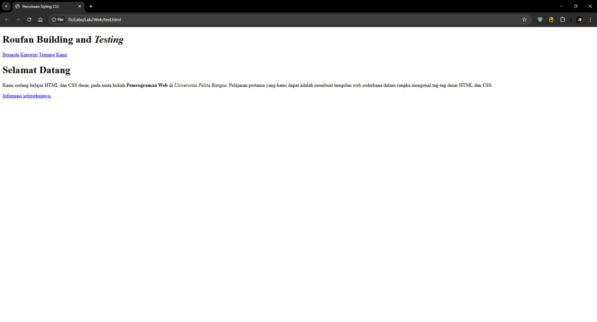
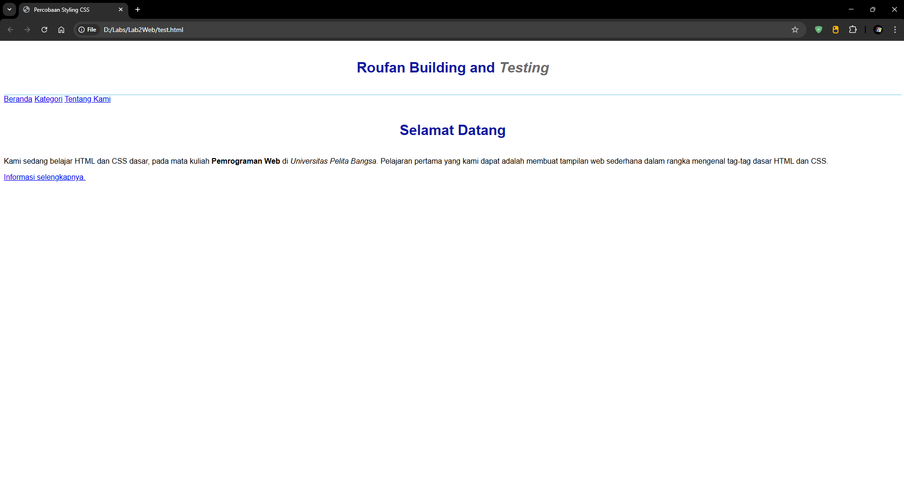
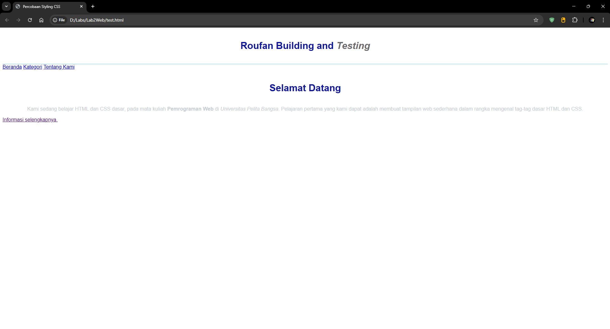
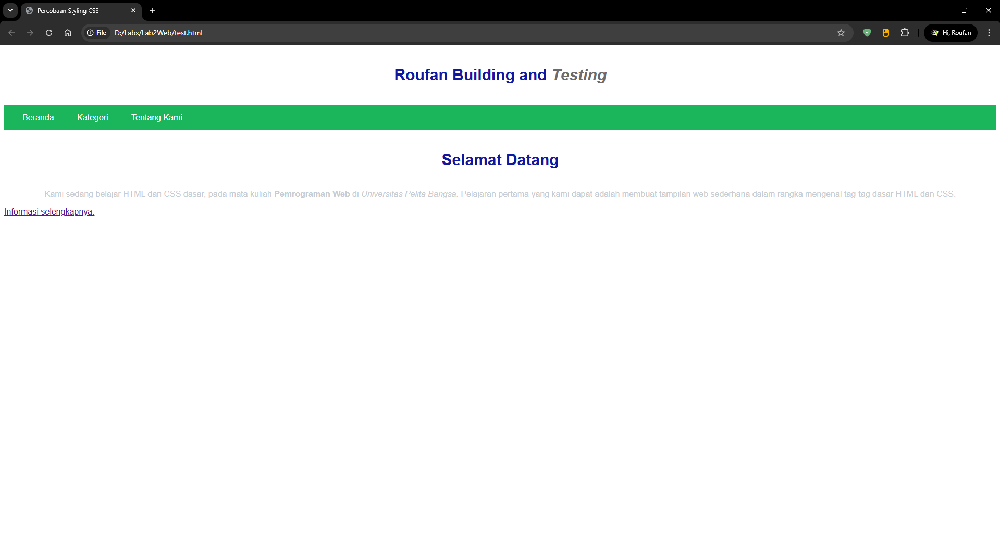
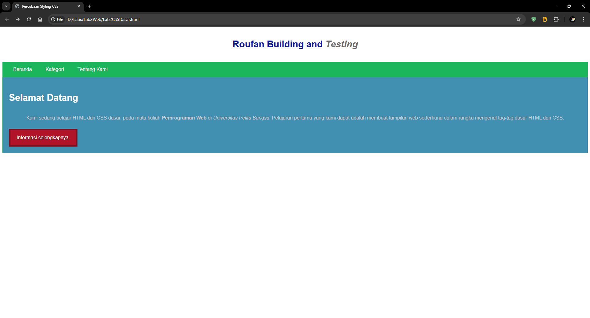

# Lab2Web

- Nama : Roufan Awaluna Romadhon
- NIM : 31240423
- Kelas : TI.24.A.3

---

## Deskripsi

Tugas ini untuk mempraktekkan dasar-dasar mendesain UI web menggunakan CSS.

## Langkah-langkah

### 1. Buat File HTML

Buatlah dokumen HTML seperti berikut

```html
<!DOCTYPE html>
<html lang="en">
<head>
    <meta charset="UTF-8">
    <meta name="viewport" content="width=device-width, initial-scale=1.0">
    <title>Percobaan Styling CSS</title>
</head>
<body>
    <header>
        <h1>Roufan Building and <i>Testing</i></h1>
    </header>
    <nav>
        <a href="lab2beranda.html">Beranda</a>
        <a href="lab2kategori.html">Kategori</a>
        <a href="lab2tentang.html">Tentang Kami</a>
    </nav>
    <!-- Mengambil ID CSS -->
     <div id="Intro">
        <h1>Selamat Datang</h1>
        <p>Kami sedang belajar HTML dan CSS dasar, pada mata kuliah <b>Pemrograman
Web</b> di <i>Universitas Pelita Bangsa</i>. Pelajaran pertama yang kami dapat
adalah membuat tampilan web sederhana dalam rangka mengenal tag-tag dasar HTML
dan CSS.</p>
        <!-- Mengambil Class CSS -->
         <a class="button btn-primary" href="#intro">Informasi selengkapnya.</a>
     </div>
</body>
</html>
```

Kemudian buka browser untuk melihat hasilnya



### 2. Mendeklarasikan CSS Internal

Kemudian tambahkan deklarasi CSS internal seperti berikut pada bagian head dokumen.

```html
<head>
    <title>Percobaan Styling CSS<title>
    <style>
        body {
            font-family:'Open Sans', sans-serif;
        }
        header {
            min-height: 80px;
            border-bottom: 1px solid #77CCEF;
        }
        h1 {
            font-size: 30px;
            color: #0F189F;
            text-align: center;
            padding: 20px 10px;
        }
        h1 i {
            color: #6d6a6b;
        }
    </style>
</head>
```

Preview bagian Head yang sudah diedit:

```html
<!DOCTYPE html>
<html lang="en">
<head>
    <meta charset="UTF-8">
    <meta name="viewport" content="width=device-width, initial-scale=1.0">
    <title>Percobaan Styling CSS</title>
    <style>
        body {
            font-family:'Open Sans', sans-serif;
        }
        header {
            min-height: 80px;
            border-bottom: 1px solid #77CCEF;
        }
        h1 {
            font-size: 30px;
            color: #0F189F;
            text-align: center;
            padding: 20px 10px;
        }
        h1 i {
            color: #6d6a6b;
        }
    </style>
</head>
```
Selanjutnya simpan perubahan yang ada, dan refresh halaman browser untuk melihat hasilnya



### 3. Menambahakan Inline CSS

Kemudian tambahkan deklarasi inline CSS pada tag <p> seperti berikut.

```html
<p style="text-align: center; color: #7d868f;">
```

Preview bagian tag <p> yang sudah diedit:

```html
        <p style="text-align: center; color: #7d868f;">Kami sedang belajar HTML dan CSS dasar, pada mata kuliah <b>Pemrograman
Web</b> di <i>Universitas Pelita Bangsa</i>. Pelajaran pertama yang kami dapat
adalah membuat tampilan web sederhana dalam rangka mengenal tag-tag dasar HTML
dan CSS.</p>
```

Simpan dan refresh halaman browsernya



### 4. Membuat CSS Eksternal

Buatlah file baru dengan nama style.css kemudian buatlah deklarasi CSS seperti berikut.

```css
nav {
    background: #1bb65b;
    color:#fff;
    padding: 15px;
}
nav a {
    color: #fff;
    text-decoration: none;
    padding:15px 20px;
}
nav .active,
nav a:hover {
    background: #086133;
}
```

Kemudian tambahkan tag <link> untuk merujuk file css yang sudah dibuat pada bagian <head>

```html
<head>
    <!-- menyisipkan css eksternal -->
    <link rel="stylesheet" href="style.css" type="text/css">
</head>
```

Preview bagian head yang telah ditambakan link ke style.css:

```html
<!DOCTYPE html>
<html lang="en">
<head>
    <meta charset="UTF-8">
    <meta name="viewport" content="width=device-width, initial-scale=1.0">
    <title>Percobaan Styling CSS</title>
    <style>
        body {
            font-family:'Open Sans', sans-serif;
        }
        header {
            min-height: 80px;
            border-bottom: 1px solid #77CCEF;
        }
        h1 {
            font-size: 30px;
            color: #0F189F;
            text-align: center;
            padding: 20px 10px;
        }
        h1 i {
            color: #6d6a6b;
        }
    </style>
    <!-- menyisipkan css eksternal -->
    <link rel="stylesheet" href="style.css" type="text/css">
</head>
```

Lalu simpan dan refresh halaman webnya.



### 5. Menambah CSS Selector

Selanjutnya menambahkan CSS Selector menggunakan ID dan Class Selector. Pada file
style.css, tambahkan kode berikut.

```css
#intro {
    background: #418fb1;
    border: 1px solid #099249;
    min-height: 100px;
    padding: 10px;
}
#intro h1 {
    text-align: left;
    border: 0;
    color: #fff;
}
/* Seleksi Class */
.button {
    padding: 15px 20px;
    background: #bebcbd;
    color: #fff;
    display: inline-block;
    margin: 10px;
    text-decoration: none;
    border: solid 5px #7c0f1d;
}
.btn-primary {
    background: #b11429;
}
```

Lalu simpan dan refresh halaman webnya.



## Pertanyaan Praktikum

1. Lakukan eksperimen dengan mengubah dan menambah properti dan nilai pada kode CSS
dengan mengacu pada CSS Cheat Sheet yang diberikan pada file terpisah dari modul ini.

Jawab:

2. Apa perbedaan pendeklarasian CSS elemen h1 {...} dengan #intro h1 {...}? berikan
penjelasannya!

Jawab:

3. Apabila ada deklarasi CSS secara internal, lalu ditambahkan CSS eksternal dan inline CSS pada
elemen yang sama. Deklarasi manakah yang akan ditampilkan pada browser? Berikan
penjelasan dan contohnya!

Jawab:

4. Pada sebuah elemen HTML terdapat ID dan Class, apabila masing-masing selector tersebut
terdapat deklarasi CSS, maka deklarasi manakah yang akan ditampilkan pada browser?
Berikan penjelasan dan contohnya! `( <p id="paragraf-1" class="text-paragraf"> )`

Jawab: